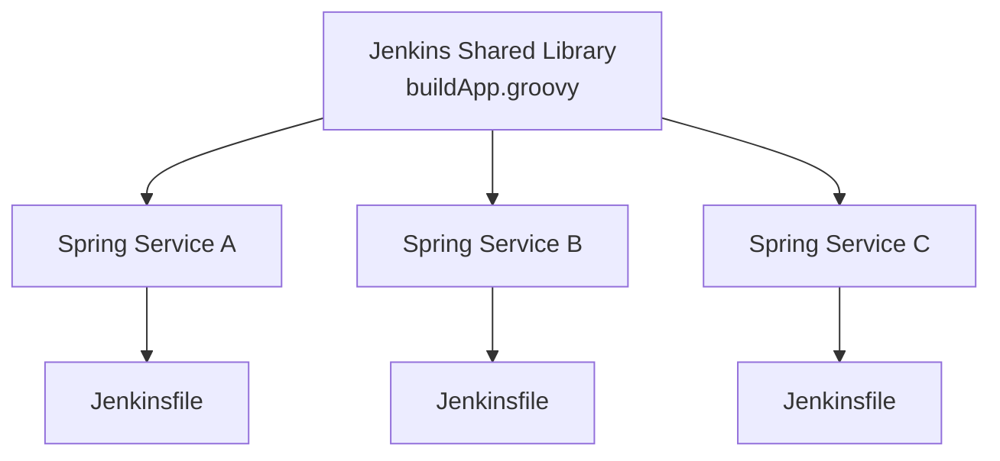
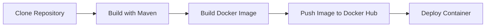
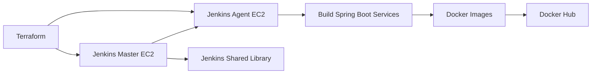
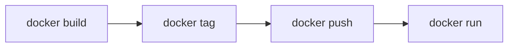
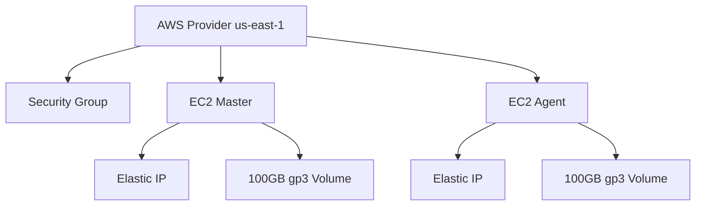
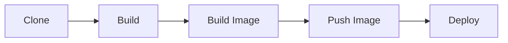

# Jenkins Shared Library CI/CD Project

## Overview

This project demonstrates a complete CI/CD workflow using Jenkins Shared Libraries for multiple Spring Boot services.

The primary goal of this project is to centralize and reuse CI/CD logic instead of duplicating pipeline code across repositories.

The same shared library is used to build, package, dockerize, push, and deploy **3 different Spring Boot services**.

---

# Workflow


---

# Architecture



Each service contains only a lightweight `Jenkinsfile` that calls the reusable shared pipeline.

---

# CI/CD Pipeline Flow



---

# Infrastructure Architecture



Infrastructure provisioning is fully automated using Terraform on AWS EC2.

---

# GitHub Repositories

## Shared Library Repository
- https://github.com/SaifOmran/shared-lib-test

## Spring Boot Service A
- https://github.com/SaifOmran/spring-petclinic-A

## Spring Boot Service B
- https://github.com/SaifOmran/spring-petclinic-B

## Spring Boot Service C
- https://github.com/SaifOmran/spring-petclinic-C

---

# Technologies Used

| Category | Technologies |
|---|---|
| Programming | Java 17 / Java 21 |
| Backend Framework | Spring Boot |
| Build Tool | Maven |
| CI/CD | Jenkins Shared Library |
| Containerization | Docker |
| Image Registry | Docker Hub |
| Infrastructure | Terraform |
| Cloud Provider | AWS |
| Operating System | Amazon Linux 2023 |

---

# Shared Library Structure

```text
shared-lib/
│
├── vars/
│   └── buildApp.groovy
│
└── README.md
```

---

# Shared Pipeline Responsibilities

The shared pipeline handles:

- Cloning source code
- Building Maven projects
- Creating Docker images
- Tagging Docker images
- Pushing images to Docker Hub
- Deploying containers automatically

---

# Docker Workflow



---

# Terraform Infrastructure

The Terraform configuration provisions:

- Jenkins Master EC2
- Jenkins Agent EC2
- Security Groups
- Elastic IPs
- 100GB EBS Volumes

Terraform also configures:

- Security groups for SSH and Jenkins access
- Latest Amazon Linux 2023 AMI
- AWS provider configuration
- Elastic IP allocation

---

# Terraform Resource Diagram



---

# Jenkins Configuration

## Required Tools

### Maven

```text
Manage Jenkins → Tools → Maven Installations
```

### JDK

```text
Manage Jenkins → Tools → JDK Installations
```

---

# Required Credentials

## Docker Hub Credentials

Add Docker Hub credentials from:

```text
Manage Jenkins → Credentials
```

Credential Type:

```text
Username with password
```

Credentials ID:

```text
docker-cred
```

---

# Jenkins Agent Configuration

The Jenkins agent connects using SSH.

Example remote root directory:

```text
/home/jenkins
```

---

# Pipeline Stages



---

# Project Features

- Reusable Jenkins Shared Library
- Multi-service CI/CD workflow
- Automated Docker image lifecycle
- Infrastructure as Code using Terraform
- Jenkins Master/Agent architecture
- Docker Hub integration
- AWS-based deployment environment
- Centralized pipeline management

---

# Future Improvements

- Kubernetes deployment
- Helm charts integration
- SonarQube code analysis
- Multi-environment deployment
- Monitoring and logging stack
- Automated rollback strategy

---
